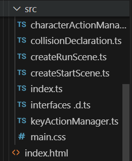

# Colliding a mesh with physics

In this section physics is added to the scene.  The mesh is moved by the player and collides with boxes in the environment.  

I have developed this code in a folder called "collisions03"  the starting point is the code for motion03.


The full listing of **createScene3.js** includes the creation of two boxes and is now:

```javascript
import { SceneData } from "./interfaces ";

import {
  Scene,
  ArcRotateCamera,
  Vector3,
  MeshBuilder,
  StandardMaterial,
  HemisphericLight,
  Color3,
  Engine,
  Texture,
  SceneLoader,
  AbstractMesh,
  ISceneLoaderAsyncResult,
  Sound
} from "@babylonjs/core";

function backgroundMusic(scene: Scene): Sound{
  let music = new Sound("music", "./assets/audio/arcade-kid.mp3", scene,  null ,
   {
      loop: true,
      autoplay: true
  });

  Engine.audioEngine!.useCustomUnlockedButton = true;

  // Unlock audio on first user interaction.
  window.addEventListener('click', () => {
    if(!Engine.audioEngine!.unlocked){
        Engine.audioEngine!.unlock();
    }
}, { once: true });
  return music;
}

function createGround(scene: Scene) {
  const groundMaterial = new StandardMaterial("groundMaterial");
  const groundTexture = new Texture("./assets/textures/wood.jpg");
  groundTexture.uScale  = 4.0; //Repeat 5 times on the Vertical Axes
  groundTexture.vScale  = 4.0; //Repeat 5 times on the Horizontal Axes
  groundMaterial.diffuseTexture = groundTexture;
 // groundMaterial.diffuseTexture = new Texture("./assets/textures/wood.jpg");
  groundMaterial.diffuseTexture.hasAlpha = true;

  groundMaterial.backFaceCulling = false;
  let ground = MeshBuilder.CreateGround(
    "ground",
    { width: 15, height: 15, subdivisions: 4 },
    scene
  );

  ground.material = groundMaterial;
  return ground;
}


function createHemisphericLight(scene: Scene) {
  const light = new HemisphericLight(
    "light",
    new Vector3(2, 1, 0), // move x pos to direct shadows
    scene
  );
  light.intensity = 0.7;
  light.diffuse = new Color3(1, 1, 1);
  light.specular = new Color3(1, 0.8, 0.8);
  light.groundColor = new Color3(0, 0.2, 0.7);
  return light;
}

function createArcRotateCamera(scene: Scene) {
  let camAlpha = -Math.PI / 2,
    camBeta = Math.PI / 2.5,
    camDist = 15,
    camTarget = new Vector3(0, 0, 0);
  let camera = new ArcRotateCamera(
    "camera1",
    camAlpha,
    camBeta,
    camDist,
    camTarget,
    scene
  );
  camera.lowerRadiusLimit = 9;
  camera.upperRadiusLimit = 25;
  camera.lowerAlphaLimit = 0;
  camera.upperAlphaLimit = Math.PI * 2;
  camera.lowerBetaLimit = 0;
  camera.upperBetaLimit = Math.PI / 2.02;

  camera.attachControl(true);
  return camera;
}

function createBox1(scene: Scene) {
  let box = MeshBuilder.CreateBox("box", { width: 1, height: 1 }, scene);
  box.position.x = -1;
  box.position.y = 4;
  box.position.z = 1;

  var texture = new StandardMaterial("reflective", scene);
  texture.ambientTexture = new Texture(
    "./assets/textures/reflectivity.png",
    scene
  );
  texture.diffuseColor = new Color3(1, 1, 1);
  box.material = texture;
  return box;
}

function createBox2(scene: Scene) {
  let box = MeshBuilder.CreateBox("box", { width: 1, height: 1 }, scene);
  box.position.x = -0.7;
  box.position.y = 8;
  box.position.z = 1;

  var texture = new StandardMaterial("reflective", scene);
  texture.ambientTexture = new Texture(
    "./assets/textures/reflectivity.png",
    scene
  );
  texture.diffuseColor = new Color3(1, 1, 1);
  box.material = texture;
  return box;
}

function importMeshA(scene: Scene, x: number, y: number) {
  let item: Promise<void | ISceneLoaderAsyncResult> =
    SceneLoader.ImportMeshAsync(
      "",
      "./assets/models/men/",
      "dummy3.babylon",
      scene
    );

  item.then((result) => {
    let character: AbstractMesh = result!.meshes[0];
    character.position.x = x;
    character.position.y = y + 0.1;
    character.scaling = new Vector3(1, 1, 1);
    character.rotation = new Vector3(0, 1.5, 0);
  });
  return item;
}

export default function createStartScene(engine: Engine) {
  let scene = new Scene(engine);
  let audio = backgroundMusic(scene);
  let lightHemispheric = createHemisphericLight(scene);
  let camera = createArcRotateCamera(scene);
  let box1 = createBox1(scene);
  let box2 = createBox2(scene);
  let player = importMeshA(scene, 0, 0);
  let ground = createGround(scene);

  let that: SceneData = {
    scene,
    audio,
    lightHemispheric,
    camera,
    box1,
    box2,
    player,
    ground,
  };
  return that;
}
```

The createRunScene function includes havok physics engine and adds the baked animations to the player which are imported from the file we have yet to create.The full listing is now:

**createRunScene.js**
```javascript
import {
  AbstractMesh,
  ActionManager,
  CubeTexture,
  Mesh,
  Skeleton,
  _ENVTextureLoader,
} from "@babylonjs/core";
import { SceneData } from "./interfaces ";
import {
  keyActionManager,
  keyDownMap,
  keyDownHeld,
  getKeyDown,
} from "./keyActionManager";
import { characterActionManager } from "./characterActionManager";
import { bakedAnimations } from "./bakedAnimations";

import "@babylonjs/core/Materials/Textures/Loaders/envTextureLoader";
import "@babylonjs/core/Helpers/sceneHelpers";

// havok physics collisions
import { collisionDeclaration } from "./collisionDeclaration";


export default function createRunScene(runScene: SceneData) {

  collisionDeclaration(runScene);
  runScene.scene.actionManager = new ActionManager(runScene.scene);
  keyActionManager(runScene.scene);

  const environmentTexture = new CubeTexture(
    "assets/textures/industrialSky.env",
    runScene.scene
  );
  const skybox = runScene.scene.createDefaultSkybox(
    environmentTexture,
    true,
    10000,
    0.1
  );
  runScene.audio.stop();

  // add baked in animations to player
  var move: bakedAnimations;
  runScene.player.then((result) => {
    let skeleton: Skeleton = result!.skeletons[0];
    move = new bakedAnimations(runScene.scene, skeleton);
  });


  runScene.scene.onBeforeRenderObservable.add(() => {
    // check and respond to keypad presses

    if (getKeyDown() == 1 && (keyDownMap["m"] || keyDownMap["M"])) {
      keyDownHeld();
      if (runScene.audio.isPlaying) {
        runScene.audio.stop();
      } else {
        runScene.audio.play();
      }
    }

    runScene.player.then((result) => {
      let characterMoving: Boolean = false;
      let character: AbstractMesh = result!.meshes[0];
      //let character: TransformNode = getAggregate().body.transformNode;
      if (keyDownMap["w"] || keyDownMap["ArrowUp"]) {
        character.position.x -= 0.1;
        character.rotation.y = (3 * Math.PI) / 2;
        characterMoving = true;
      }
      if (keyDownMap["a"] || keyDownMap["ArrowLeft"]) {
        character.position.z -= 0.1;
        character.rotation.y = (2 * Math.PI) / 2;
        characterMoving = true;
      }
      if (keyDownMap["s"] || keyDownMap["ArrowDown"]) {
        character.position.x += 0.1;
        character.rotation.y = (1 * Math.PI) / 2;
        characterMoving = true;
      }
      if (keyDownMap["d"] || keyDownMap["ArrowRight"]) {
        character.position.z += 0.1;
        character.rotation.y = (0 * Math.PI) / 2;
        characterMoving = true;
      }

      if (getKeyDown() && characterMoving) {
        if (!move.getAnimating()) {
          move.walk();
          move.toggleAnimating();
        }
      } else {
        if (move.getAnimating()) {
          move.idle();
          move.toggleAnimating();
        }
      }
    });
  });

  // add incremental action to player
  runScene.player.then((result) => {
    let characterMesh = result!.meshes[0];
    characterActionManager(runScene.scene, characterMesh as Mesh);
  });

  runScene.scene.onAfterRenderObservable.add(() => { });
}
```

Now we need to create the file **bakedAnimations.js** with a full listing:

**bakedAnimations.js**
```javascript


import { Scene } from "@babylonjs/core/scene";
import { AnimationPropertiesOverride, AnimationRange, Nullable, Skeleton } from "@babylonjs/core";


export class bakedAnimations {

  animating: Boolean = false;
  walkRange: Nullable<AnimationRange>;
  runRange: Nullable<AnimationRange>;
  leftRange: Nullable<AnimationRange>;
  rightRange: Nullable<AnimationRange>;
  idleRange: Nullable<AnimationRange>;
  animScene: Scene;
  animSkeleton: Skeleton;

  // constructor
  constructor(myscene: Scene, skeleton: Skeleton) {
    // use baked in animations
    this.animScene = myscene;
    this.animSkeleton = skeleton;
    this.animSkeleton.animationPropertiesOverride = new AnimationPropertiesOverride();
    this.animSkeleton.animationPropertiesOverride.enableBlending = true;
    this.animSkeleton.animationPropertiesOverride.blendingSpeed = 0.05;
    this.animSkeleton.animationPropertiesOverride.loopMode = 1;

    this.walkRange = skeleton.getAnimationRange("YBot_Walk");
    this.runRange = skeleton.getAnimationRange("YBot_Run");
    this.leftRange = skeleton.getAnimationRange("YBot_LeftStrafeWalk");
    this.rightRange = skeleton.getAnimationRange("YBot_RightStrafeWalk");
    this.idleRange = skeleton.getAnimationRange("YBot_Idle");


  }

  walk() {
    this.animScene.beginAnimation(this.animSkeleton, this.walkRange!.from, this.walkRange!.to, true);
  }

  run() {
    this.animScene.beginAnimation(this.animSkeleton, this.runRange!.from, this.runRange!.to, true);
  }

  left() {
    this.animScene.beginAnimation(this.animSkeleton, this.leftRange!.from, this.leftRange!.to, true);
  }

  right() {
    this.animScene.beginAnimation(this.animSkeleton, this.rightRange!.from, this.rightRange!.to, true);
  }

  idle() {
    this.animScene.beginAnimation(this.animSkeleton, this.idleRange!.from, this.idleRange!.to, true);
  }

  stopAnimation() {
    this.animScene.stopAnimation(this.animSkeleton);
  }

  getAnimating(): Boolean { return this.animating };

  toggleAnimating() { this.animating = !this.animating };

  info() {
    // console.log(this.idleRange!.from, this.idleRange!.to);
  }
}
```
The full structure in the src folder should look like this:



The final version should run but before building we will need to update the typescript configuration to adapt to havok physics.

